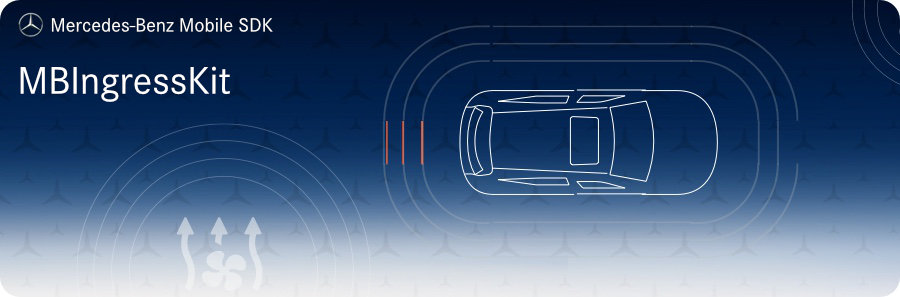

<!-- SPDX-License-Identifier: MIT -->




## Requirements
* __Minimum Android SDK:__ MBIngressKit requires a minimum API level of 21. 
* __Compile Android SDK:__ MBIngressKit requires you to compile against minimum API level 27.

## Intended Usage

MBIngressKit provides you with services and functions related to users and user authentication.

### Initialization
The initialization requires the application context and a previous initialization of `MBNetworkKit`.  
The minimal setup needs 5 important string values:  
1. `AUTH_URL` - the base url pointing to the JWT token api
2. `USER_URL` - the base url pointing to user related REST APIs
3. `STAGE` - either "int" or "prod", depending on your stage
4. `ALIAS` - the alias used for crypto operations using the `KeyStore` API
5. `CLIENT_ID` - your client id
```kotlin
MBIngressKit.init(
    IngressServiceConfig.Builder(
        appContext, AUTH_URL, USER_URL, STAGE, ALIAS, MBNetworkKit.headerService(), CLIENT_ID
    ).apply {
        // If using the Single-SignOn feature:
        enableSso("my_shared_user_id")
        // device identifier
        useDeviceId("my_device_id")
    }
)
```

## Installation

Add the following maven url to your project `build.gradle`:  
```gradle
allprojects {
    repositories {
        google()
        jcenter()
        maven {
            url 'https://pkgs.dev.azure.com/daimler-ris/sdk/_packaging/release/maven/v1'
        }
    }
}
```

Add to your app's `build.gradle`:  
```gradle
implementation "com.daimler.mm:MBIngressKit:$mb_ingress_kit_version"
```

## Contributing

We welcome any contributions.
If you want to contribute to this project, please read the [contributing guide](CONTRIBUTING.md).

## Code of Conduct

Please read our [Code of Conduct](https://github.com/Daimler/daimler-foss/blob/master/CODE_OF_CONDUCT.md) as it is our base for interaction.

## License

This project is licensed under the [MIT LICENSE](LICENSE).

## Provider Information

Please visit <https://mbition.io/en/home/index.html> for information on the provider.

Notice: Before you use the program in productive use, please take all necessary precautions,
e.g. testing and verifying the program with regard to your specific use.
The program was tested solely for our own use cases, which might differ from yours.
